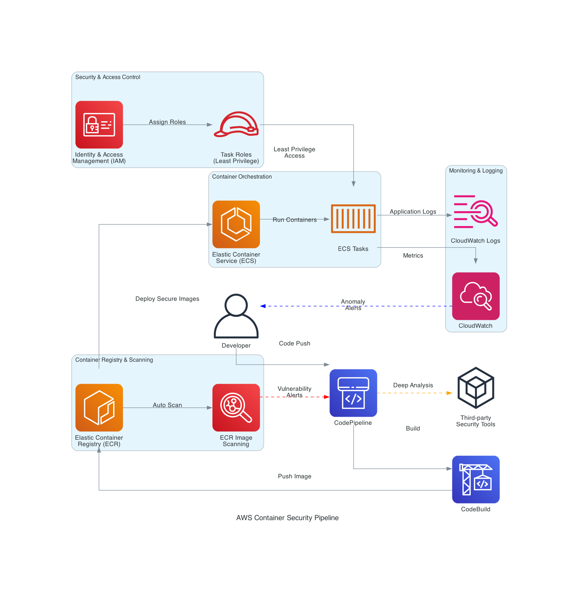

# Container-Security-Falcon
This project will be about how we secure containers in the cloud before deployment. The container will be stored inside ECR. We will use ECS to write tasks that should be executed before deployment. We will make use of codepipeline to automate the deployment process.

## System Design:


## Folder structure:

## Installation:
### Terraform Commands:

To deploy this infrastructure using Terraform, execute the following commands in order:

1.  **Initialize Terraform:**
    ```bash
    terraform init
    ```

2.  **Review the Planned Changes:**
    ```bash
    terraform plan
    ```

3.  **Apply the Configuration:**
    ```bash
    terraform apply
    ```
## Contact us:
