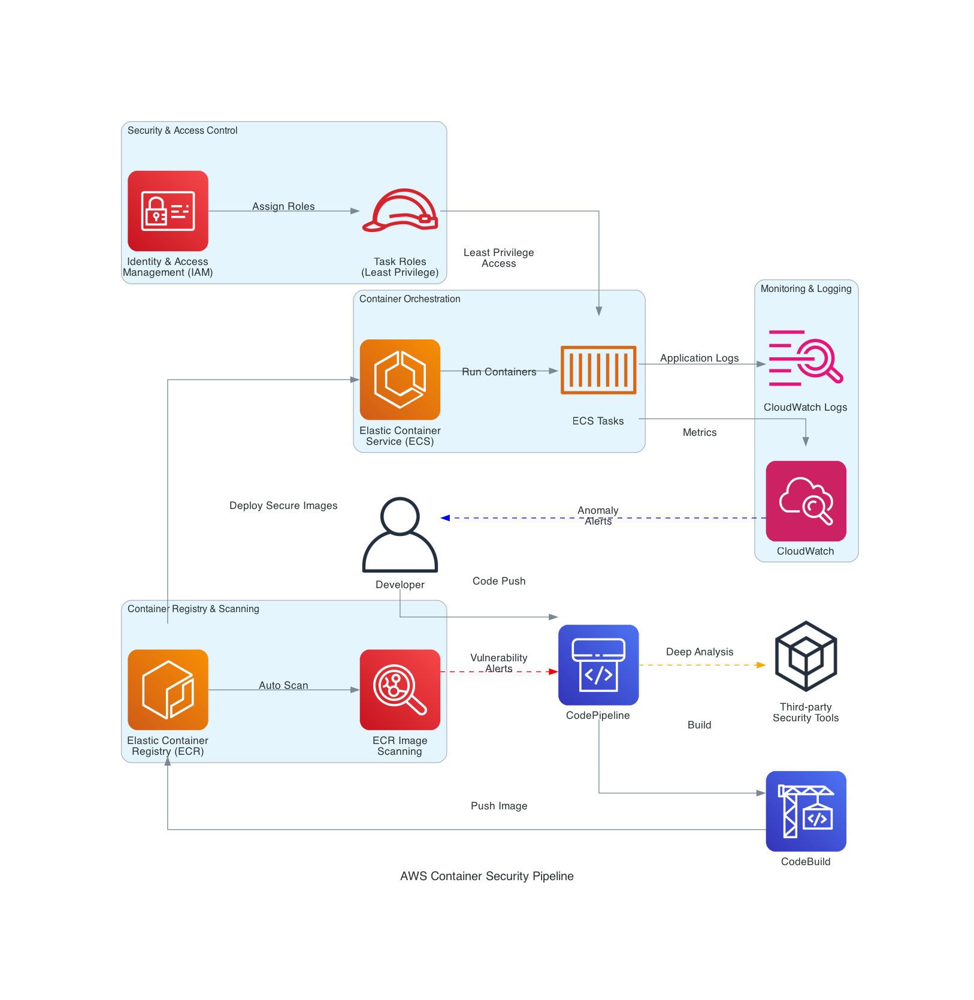

# Container-Security-Falcon

This project will be about how we secure containers in the cloud before deployment. The container will be stored inside ECR. We will use ECS to write tasks that should be executed before deployment. We will make use of codepipeline to automate the deployment process.

## System Design:



## Folder structure:

## Installation:

### Terraform Commands:

To deploy this infrastructure using Terraform, execute the following commands in order:

1.  **Initialize Terraform:**

    ```bash
    terraform init
    ```

2.  **Review the Planned Changes:**

    ```bash
    terraform plan
    ```

3.  **Apply the Configuration:**
    ```bash
    terraform apply
    ```

### Configuration

Populate `terraform.tfvars` with the Amazon ECR repository name you want the pipeline to monitor. Optionally override `ecr_image_tag` if you want to trigger on a tag other than `latest`.

## Pipeline Flow

1. A container image is pushed to the configured Amazon ECR repository and tag.
2. Amazon ECR emits an event that starts an AWS CodePipeline execution.
3. CodePipeline passes the `imageDetail.json` source artifact to AWS CodeBuild.
4. CodeBuild logs into ECR, pulls the image, captures metadata (`docker_inspect.json`, `ecr_manifest.json`), runs a Trivy scan, and emits artifacts.
5. The generated `imagedefinitions.json` keeps the downstream ECS deploy stage pointed at the newly scanned image.

## Image push

### Standard Build (Linux/Intel Mac)

Step 1: Build your Docker image with linux/amd64 platform
```bash
docker build --platform linux/amd64 -t <id-number>.dkr.ecr.us-east-1.amazonaws.com/box-office-repo:latest .
```

Step 2: Login to ECR
```bash
aws ecr get-login-password --region us-east-1 | docker login --username AWS --password-stdin <id-number>.dkr.ecr.us-east-1.amazonaws.com
```

Step 3: Push your image to ECR
```bash
docker push <id-number>.dkr.ecr.us-east-1.amazonaws.com/box-office-repo:latest
```

### Apple Silicon (M1/M2/M3) Build

For Apple Silicon Macs, cross-platform building with Node.js/esbuild can fail under QEMU emulation. Use this approach instead:

Step 1: Build the application locally
```bash
npm ci
npm run build
```

Step 2: Login to ECR
```bash
aws ecr get-login-password --region us-east-1 | docker login --username AWS --password-stdin <id-number>.dkr.ecr.us-east-1.amazonaws.com
```

Step 3: Build Docker image using the simplified AMD64 Dockerfile with pre-built assets
```bash
docker buildx build --platform linux/amd64 -f Dockerfile.amd64 -t <id-number>.dkr.ecr.us-east-1.amazonaws.com/box-office-repo:latest --load .
```

Step 4: Push your image to ECR
```bash
docker push <id-number>.dkr.ecr.us-east-1.amazonaws.com/box-office-repo:latest
```

**Note:** The `Dockerfile.amd64` uses pre-built assets from the `dist` folder and only packages them in an nginx container for the correct AMD64 platform that ECS requires.

Once the image push completes, CodePipeline pulls the new image through CodeBuild for inspection and scanning before the ECS service update runs.

## Contact us:

```

```
