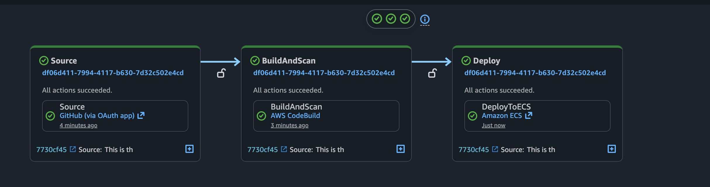
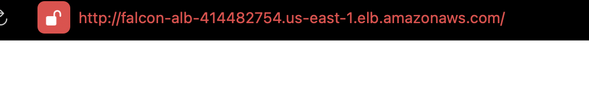
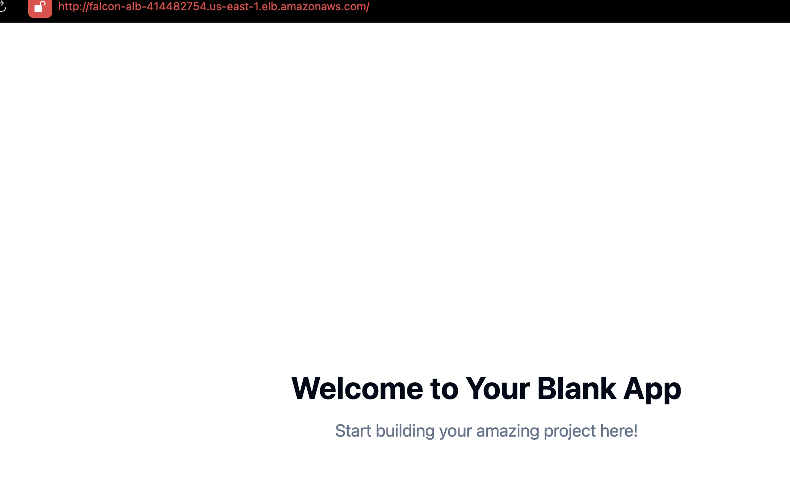

# Container-Security-Falcon

This project demonstrates how we secure containers in the cloud before deployment. The container is stored inside ECR and deployed using ECS. We use AWS CodePipeline to automate the deployment process, triggered automatically from GitHub pushes.

## System Design:


## Folder structure:

```
├── dist/
├── node_modules/
├── policy/
├── public/
├── src/
├── system_design/
├── .dockerignore
├── .gitignore
├── AGENTS.md
├── aws.tf
├── buildspec-build.yml
├── buildspec.yml
├── bun.lockb
├── codebuild.tf
├── codepipeline.tf
├── components.json
├── deploy-buildspec.yml
├── Dockerfile
├── Dockerfile.amd64
├── ec2.yaml
├── ecr.tf
├── ecs.tf
├── eslint.config.js
├── gpt-5.md
├── iam.tf
├── index.html
├── main.tf
├── network.tf
├── outputs.tf
├── package-lock.json
├── package.json
├── postcss.config.js
├── README.md
├── s3.tf
├── secrets.tf
├── state.tf
├── tailwind.config.ts
├── terraform.tfvars.example
├── tfplan
├── tfplan.binary
├── tfplan.json
├── tsconfig.app.json
├── tsconfig.json
├── tsconfig.node.json
├── variables.tf
└── vite.config.ts
```

## Installation:

### Terraform Commands:

To deploy this infrastructure using Terraform, execute the following commands in order:

1.  **Initialize Terraform:**

    ```bash
    terraform init
    ```

2.  **Review the Planned Changes:**

    ```bash
    terraform plan
    ```

3.  **Apply the Configuration:**
    ```bash
    terraform apply
    ```

### Configuration

Populate `terraform.tfvars` with the Amazon ECR repository name you want the pipeline to monitor. Optionally override `ecr_image_tag` if you want to trigger on a tag other than `latest`.

## Pipeline Flow

1. Code is pushed to the GitHub repository.
2. GitHub push event triggers AWS CodePipeline execution.
3. CodePipeline pulls the source code from GitHub and passes it to AWS CodeBuild.
4. CodeBuild builds the Docker image, pushes it to ECR, captures metadata (`docker_inspect.json`, `ecr_manifest.json`), runs a Trivy scan, and emits artifacts.
5. The generated `imagedefinitions.json` keeps the downstream ECS deploy stage pointed at the newly scanned image.
6. ECS service is updated with the new container image.

## Deployment

Deployment is now fully automated! Simply push your code changes to the GitHub repository, and the pipeline will:
- Build the application
- Create a Docker image
- Scan for vulnerabilities
- Deploy to ECS

Step 1: Check build status is successful


Step 2: Verify container is running on ECS


Step 3: Verify the website is working


## Improvements:
we will be using OPAs to have policy as code.
